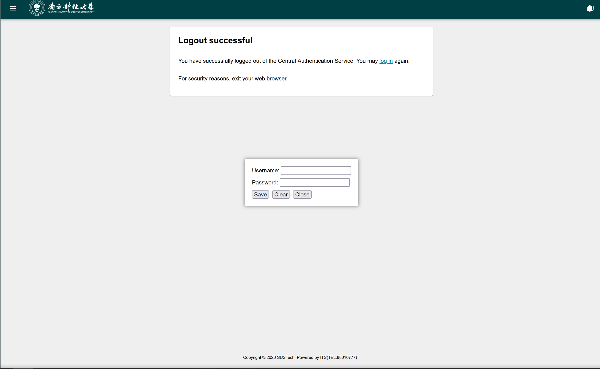

# SUSTech Auto Login

自动进行 CAS 单点登录，并刷新页面

## 免责声明

本脚本需要在 Tempermonkey 脚本管理器中存储用户名和密码，因此请确保您的设备安全，**不要在不可信或公共设备上使用此脚本**。请从下方连接安装脚本，防止安装到被恶意修改的脚本。对于使用此脚本造成的任何损失，作者概不负责。

## 安装

请使用 Tampermonkey 脚本管理器：[官网](https://www.tampermonkey.net/)

[点击此处安装此脚本](https://github.com/vollate/SUSTech-auto-login/blob/main/sustech-auto-login.user.js)

## 使用

第一次使用时，需要打开任意一个cas网站，例如[这个](https://cas.sustech.edu.cn/cas/login)(因为脚本只在 cas.sustech.edu.cn 下运行)。然后输入用户名和密码，点击登录，然后点击浏览器右上角的 Tampermonkey 图标，点击 `SUSTech Auto Login`，然后点击 `CAS Login Settings`，输入用户名和密码，点击确定。之后每次打开 cas 网站时，脚本会自动填写用户名和密码并登录。该界面也可以清除已保存的密码。

